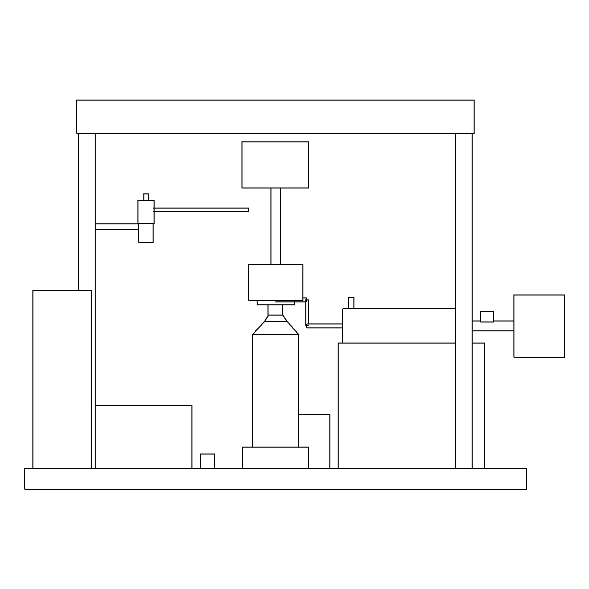
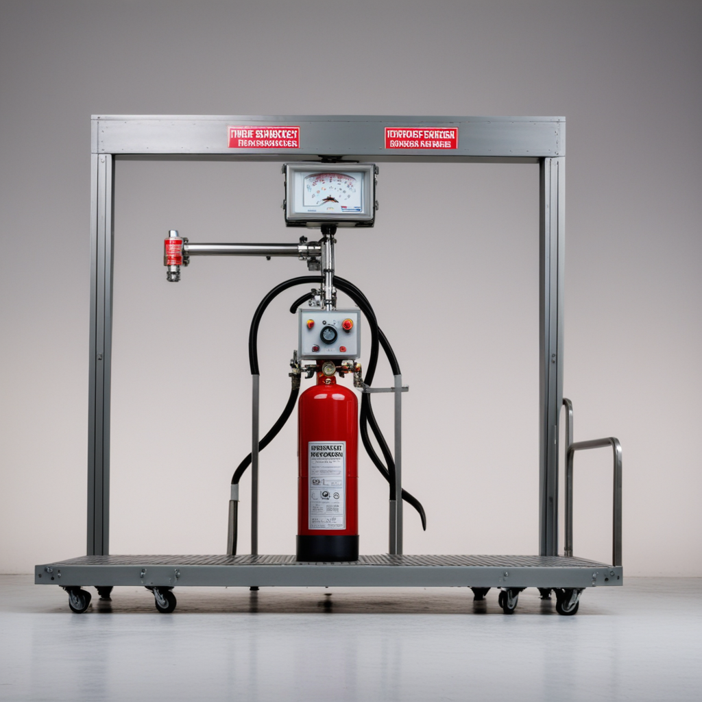
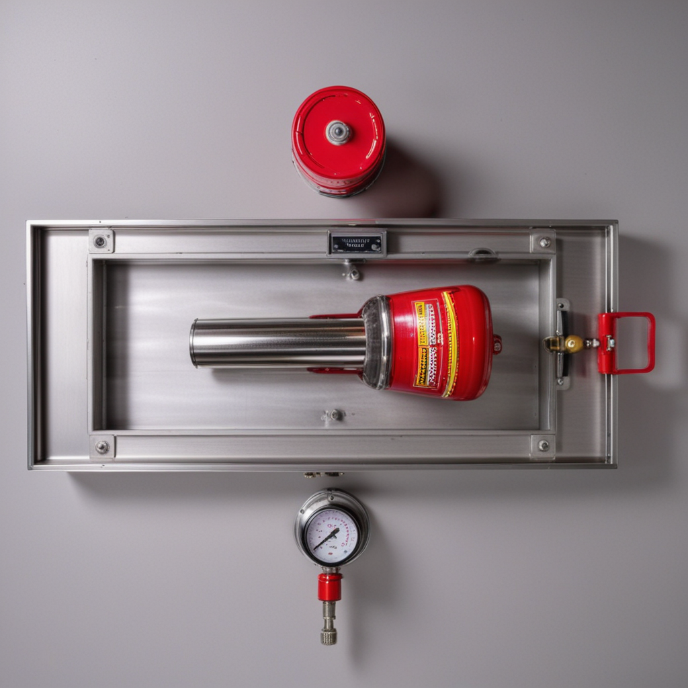
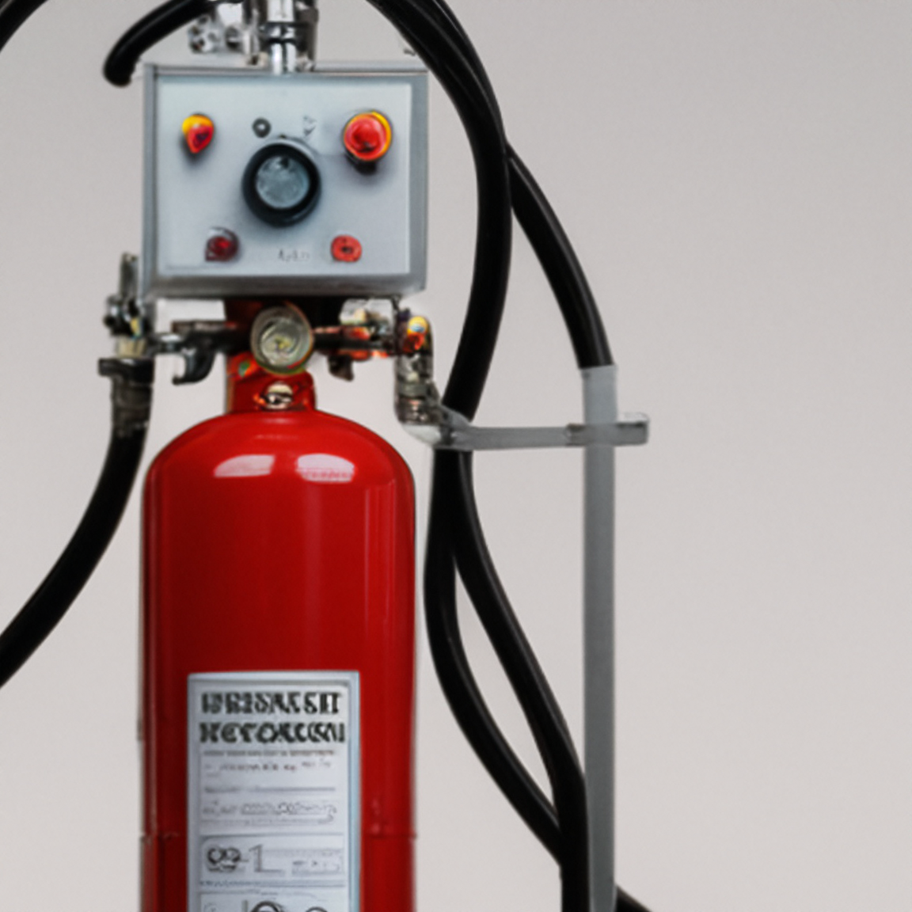

# product-showcase-pipeline

从产品结构拓扑图 + 文字说明书出发，用 ControlNet + CAD 投影 + 图像生成模型产出**产品展示图全套**：产品设计线稿、渲染图、标准三视图、核心结构细节及放大图。

两个 [ZCode](https://github.com/ZCode-hub) skills（也可独立当脚本库用）：

| Skill | 方向 | 核心技术 |
|---|---|---|
| [`skills/topo2sketch`](skills/topo2sketch/SKILL.md) | 拓扑图/专利剖视图 → 设计线稿 | OpenCV 去标注/剖面线 + ControlNet lineart + SD1.5 |
| [`skills/sketch2showcase`](skills/sketch2showcase/SKILL.md) | 线稿 → 渲染图/三视图/细节放大 | cadquery HLR 投影 + MistoLine + RealVisXL V5 + x4-upscaler |

## 管线总览

```
说明书(文字) ─┐
              ├─[结构解析·LLM]→ 结构 JSON（部件清单/视图规划/裁剪框）
拓扑图(剖视)─┤
              └─[topo2sketch]→ 设计线稿 ──┐
                                          ├─[sketch2showcase 渲染]→ 展示图
CAD 简模 ─[cad_views 投影]→ 三视图线稿 ──┤
   │                                      └─▶ 三视图渲染
   └─[裁局部]──[x4 放大]──▶ 核心结构细节及放大图
```

**铁律：AI 只负责"怎么好看"，不负责"长什么样"。** 三视图与结构图的线稿控制图必须
来自几何投影或既有线稿，禁止 txt2img 直出。

## 安装

```bash
# 作为 ZCode skill 安装（二选一路径）
cp -r skills/* ~/.zcode/skills/
# 或 cp -r skills/* ~/.agents/skills/

# 依赖（两个 skill 各建一个 venv 亦可）
pip install torch --index-url https://download.pytorch.org/whl/cu128   # NVIDIA GPU；Blackwell 必须 cu128
pip install "diffusers>=0.40" accelerate transformers safetensors opencv-python pillow
pip install cadquery                                                    # 仅 CAD 投影路线需要
```

## 快速开始

```bash
# 1. 下载模型（走 hf-mirror）
python skills/sketch2showcase/scripts/download_models.py --root models

# 2. CAD 简模投影三视图线稿（示例：水压试验机，34 实体）
python skills/sketch2showcase/scripts/cad_views.py examples/hydrostatic_tester_model.py \
    --out-dir output/cad --views front,side,top

# 3. 渲染展示图
python skills/sketch2showcase/scripts/generate_showcase.py output/cad/view_front.png \
    --product "automatic hydrostatic testing machine for fire extinguisher cylinders" \
    --view "front view" --seeds 101,202

# 4. 细节放大图
python skills/sketch2showcase/scripts/detail_zoom.py output/showcase/xxx.png --box 390,430,680,720
```

上游线稿生成：

```bash
python skills/topo2sketch/scripts/download_models.py --root models
python skills/topo2sketch/scripts/prep_control.py topo.png --out output/control_clean.png \
    --erase-box 2,42,96,80 --hatch-zone 140,86,390,114
python skills/topo2sketch/scripts/generate.py output/control_clean.png \
    --prompt "product design sketch of ..., front view, black ink linework on white paper" \
    --out output/sketch.png
```

## 效果示例

| CAD 投影三视图线稿 | 前视图渲染 | 俯视渲染 |
|---|---|---|
|  |  |  |

细节放大（对接密封头+瓶口区）：



## 硬件与已知坑

- 实测环境：RTX 5070 Ti 16GB（Blackwell，torch cu128）、Windows、32GB 内存上限中的 16GB 物理
  内存——SDXL 加载必须流式进显存（脚本已内置 `device_map` 方案），否则 MemoryError。
- 模型权重：RealVisXL V5、MistoLine、x4-upscaler、SD1.5、control_v11p_sd15_lineart
  （脚本走 hf-mirror，已规避新版 huggingface_hub 的 Xet 401）。
- **不要用 AutoCAD 的 SOLVIEW/VIEWBASE 做脚本投影**：交互提示在 COM/SendCommand 下不可控，
  实测卡死。cadquery 的 OCCT HLR 全确定性。
- 更多坑与参数细节见各 skill 的 SKILL.md「必踩坑」小节。

## License

MIT
